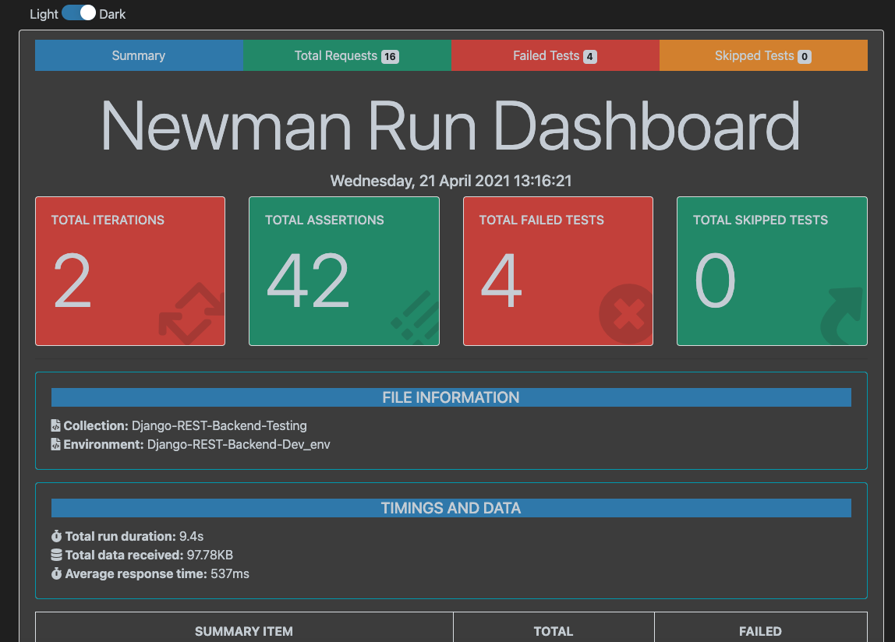

# Creating Microservices - Django REST
## Features

- Creating a microservices for a customer who can access customer portfolio
    - The customer portfilio includes- Coin access, Exchanges -Thirdparty    
- This is just a template and customizable according to your project requirement

## Tech

Tools used to create microservices:

- [Django-REST] - build and project configuration
- [Docker] - An open source UI automation tools
- [PyTest] - A library used for UnitTesting
- [Postman] - A tool used for API Testing
- [Pact-IO] - Writing Contract Tests 
- [Locust-IO]  - A tool used for performance testing
- [Anchore] - A tool used for Container security testing
- Database - For now, default database

## Design


## Installation

This requires [python] 3.0+

Install the dependencies and devDependencies and start the server.

```sh
Download the repository using
        git clone https://github.com/uday160386/udays-tj-backend-app.git
    and do
        python3 -m venv venv
        source venv/bin/activate
        pip install -r requirements.txt
```
### Build with Docker
```sh
    docker build -t <DOCKER_PATH>:<TAG>
```
## Run with Docker compose locally
```sh
    Docke-compose up
```

## How to execute Tests?
```sh
    API Testcases are available at tests/ 
        Run the postman collection using Newman in CI:
            "newman run tests/Django-REST-Backend-Testing.postman_collection.json -e
            tests/env/Django-REST-Backend-Dev_env.postman_environment.json 
            -d tests/data/data.csv -r htmlextra --reporter-htmlextra-export ./results/report.html"
     
            
```
Note:The above paths are for reference and can be saved at your preferred path
## How to view Report?
```sh
    Reports are available at : "./results/report.html"
```

## Sample Report
    

## CI View
    
## work is still in progress .....

[//]: # (These are reference links used in the body of this note and get stripped out when the markdown processor does its job. There is no need to format nicely because it shouldn't be seen. Thanks SO - http://stackoverflow.com/questions/4823468/store-comments-in-markdown-syntax)

[Django-REST]: <https://www.django-rest-framework.org/>
[Docker]: <https://www.docker.com/>
[PyTest]: <https://docs.pytest.org/en/6.2.x/>
[Docker-Repo]:  <https://hub.docker.com/u/venmaum>
[Locust-IO]: <https://locust.io/>
[Pact-IO]: <https://pact.io/>
[Anchore]: <https://anchore.com/>
[PostMan]: <https://www.postman.com/>
